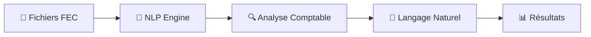
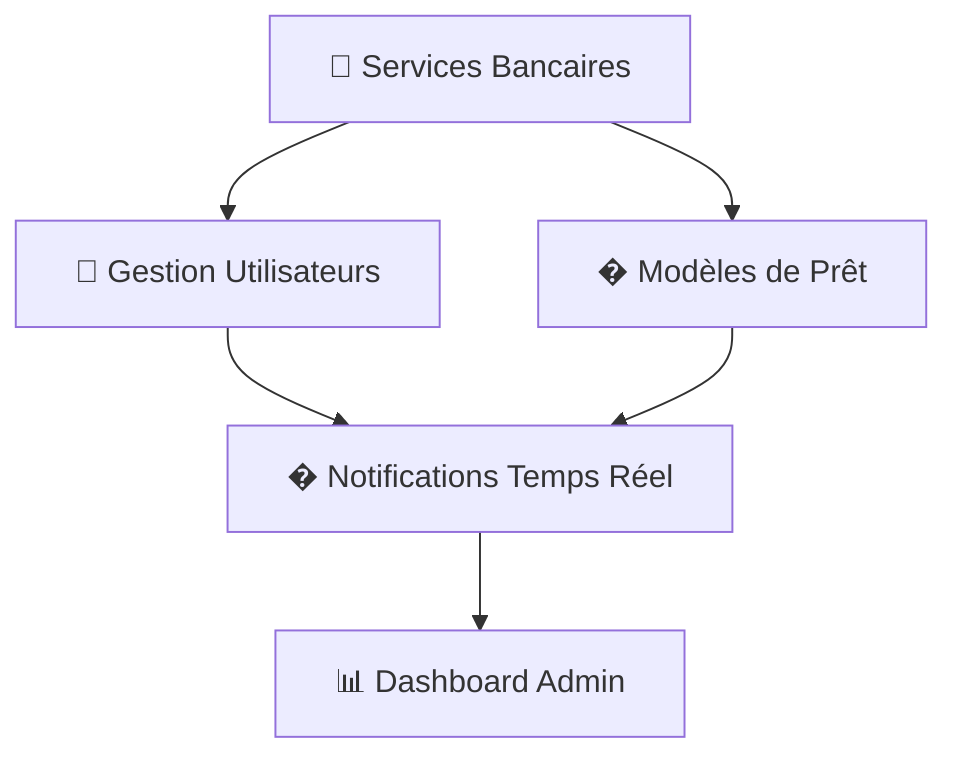
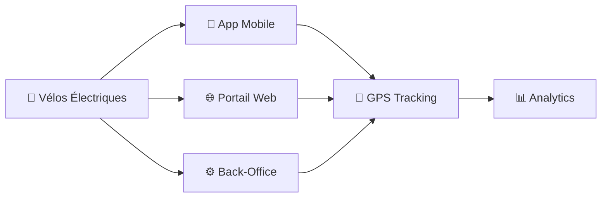

<div align="center">

<!-- Animated Header -->


</div>

<div align="center">
  
[](https://git.io/typing-svg)

</div>

---

<div align="center">

### 🎯 Aperçu Rapide

```ascii
╔══════════════════════════════════════════════════════════════════╗
║  👨‍💻 Full-Stack Engineer | 🎓 Ingénieur en Informatique          ║
║  🌍 Tunis, Tunisie   | 📧 mejri.achref.working@gmail.com        ║
║  🔗 LinkedIn: achref-mejri-8a9253179                            ║
╚══════════════════════════════════════════════════════════════════╝
```

</div>

---

## 🌟 À Propos de Moi


```yaml
name: Achref Mejri
role: Ingénieur Full-Stack | Web & Mobile Developer
location: Tunis, Tunisie
email: mejri.achref.working@gmail.com
education: 
  - degree: "Ingénieur en Informatique"
    specialization: "Génie Logiciel & Architecture des Systèmes d'Information"
    institution: "Esprit - École Supérieure Privée d'Ingénierie et de Technologie"
    year: "2020 - 2025"

expertise: 
  - Applications Web & Mobile (Angular, React, Next.js, Ionic)
  - Applications Temps Réel (WebSockets, Socket.IO)
  - Intégration IA (Chatbots, NLP, ChatGPT API)
  - Architecture Logicielle Scalable
  - Backend (Node.js, Python, GraphQL, NestJS)
  - Frontend (Angular, React, Next.js, TailwindCSS)
  - Bases de Données (PostgreSQL, MongoDB, Redis)
  
philosophy: |
  "Concevoir des solutions scalables, centrées utilisateur
   et orientées performance pour transformer les idées en réalité"
```

<br clear="both"/>

---

## 🔥 Compétences & Expertise

<div align="center">

### 💻 Langages de Programmation

<table>
<tr>
<td align="center" width="100">

<br>Python
</td>
<td align="center" width="100">

<br>Java
</td>
<td align="center" width="100">

<br>JavaScript
</td>
<td align="center" width="100">

<br>TypeScript
</td>
<td align="center" width="100">

<br>C#
</td>
<td align="center" width="100">

<br>PHP
</td>
</tr>
</table>

### 🎨 Frontend Technologies

<table>
<tr>
<td align="center" width="100">

<br>React
</td>
<td align="center" width="100">

<br>Next.js
</td>
<td align="center" width="100">

<br>Angular
</td>
<td align="center" width="100">

<br>TailwindCSS
</td>
<td align="center" width="100">

<br>HTML5
</td>
<td align="center" width="100">

<br>CSS3
</td>
</tr>
</table>

### ⚡ Backend & APIs

<table>
<tr>
<td align="center" width="100">

<br>Node.js
</td>
<td align="center" width="100">

<br>Express.js
</td>
<td align="center" width="100">

<br>NestJS
</td>
<td align="center" width="100">

<br>GraphQL
</td>
<td align="center" width="100">

<br>Spring Boot
</td>
<td align="center" width="100">

<br>Socket.IO
</td>
</tr>
</table>

### 📱 Mobile Development

<table>
<tr>
<td align="center" width="100">

<br>Ionic
</td>
<td align="center" width="100">

<br>React Native
</td>
<td align="center" width="100">

<br>Kotlin
</td>
<td align="center" width="100">

<br>Swift
</td>
<td align="center" width="100">

<br>Flutter
</td>
<td align="center" width="100">

<br>Android Studio
</td>
</tr>
</table>

### 🗄️ Bases de Données

<table>
<tr>
<td align="center" width="100">

<br>PostgreSQL
</td>
<td align="center" width="100">

<br>MongoDB
</td>
<td align="center" width="100">

<br>Redis
</td>
<td align="center" width="100">

<br>MySQL
</td>
<td align="center" width="100">

<br>Firebase
</td>
<td align="center" width="100">

<br>SQLite
</td>
</tr>
</table>

### 🤖 IA & Temps Réel

<table>
<tr>
<td align="center" width="100">

<br>NLP
</td>
<td align="center" width="100">

<br>TensorFlow
</td>
<td align="center" width="100">

<br>Flask
</td>
<td align="center" width="100">

<br>ChatGPT API
</td>
<td align="center" width="100">

<br>WebSockets
</td>
<td align="center" width="100">

<br>Streamlit
</td>
</tr>
</table>

### 🛠️ Outils & DevOps

<table>
<tr>
<td align="center" width="100">

<br>Git
</td>
<td align="center" width="100">

<br>Docker
</td>
<td align="center" width="100">

<br>AWS
</td>
<td align="center" width="100">

<br>GitLab CI
</td>
<td align="center" width="100">

<br>Postman
</td>
<td align="center" width="100">

<br>VS Code
</td>
</tr>
</table>

</div>

---

## 📊 Statistiques GitHub

<div align="center">
  


</div>

---

## 🏆 Trophées GitHub

<div align="center">
  


</div>

---

## 🎯 Expériences Professionnelles

<div align="left">

### 💼 **Full Stack Developer** | Binomial (Expertise Comptable)
📅 *Décembre 2024 - Présent* | Paris, France — Bureau de Tunis (Lac 1)

**Projet:** ChatCount - Assistant IA Comptable



**Réalisations:**
- 🤖 Développement de **ChatCount**, un chatbot intelligent pour l'analyse de fichiers comptables (FEC)
- 🧠 Moteur d'analyse combinant **NLP**, reconnaissance de structures comptables et génération de requêtes MongoDB
- � Migration vers **GraphQL & Next.js** (prévue mai 2025) pour scalabilité et maintenabilité
- 💡 Requêtes en langage naturel pour extractions, filtres et analyses comptables
- **Stack:** Angular · Node.js · Python · MongoDB → GraphQL · Next.js

---

### 💼 **Full Stack Developer (Focus Frontend)** | Easy Bank - Mission Freelance
📅 *Avril 2025 - Août 2025* | Télétravail (4 mois)

**Projet:** Dashboard Admin Bancaire Multilingue



**Réalisations:**
- 🎨 Interface **dashboard admin multilingue** pour gestion complète des services bancaires
- 📋 Formulaires dynamiques et workflows d'onboarding personnalisés
- 🔔 Système de **notifications temps réel** avec **Socket.IO**
- 💅 UX responsive avec **TailwindCSS** et **shadcn/ui**
- 🏦 Plateforme adoptée par plusieurs partenaires bancaires pour automatiser les parcours clients
- **Stack:** Next.js · TailwindCSS · shadcn/ui · GraphQL · NestJS · Socket.IO · PostgreSQL

---

### 💼 **Co-founder & Full Stack Developer** | VOLO-BIKES - Projet de Fin d'Études
📅 *Février 2024 - Août 2024* | Tunisie

**Projet:** Solution de Mobilité Urbaine Électrique (MENA)



**Réalisations:**
- � Lancement d'une **solution innovante de mobilité urbaine électrique** pour la région MENA
- 📱 Développement de **3 plateformes** : portail d'achat, app mobile client, système de gestion interne
- 🗺️ **Tracking GPS temps réel** avec **Mapbox** et **Socket.IO** pour suivi des véhicules
- 📊 Outils d'analytics métier : taux d'utilisation, alertes maintenance, heatmaps de mobilité
- 🏆 Projet labellisé **"Startup"** et présenté comme produit pilote lors de salons d'innovation
- **Stack:** Angular · Ionic · Node.js · Redis · Socket.IO · Mapbox · PostgreSQL

---

### 💼 **Chef d'Équipe (Freelance)** | Viribus Centre
📅 *Mars 2024 - Août 2024* | Tunisie

**Projet:** Dashboard Analytics Temps Réel BIM & RDV

**Réalisations:**
- � Dashboard **temps réel** pour gestion BIM & RDV avec visualisation de données
- ☁️ Déploiement sur **AWS** avec optimisation de la scalabilité
- 📈 Amélioration de la prise de décision via reporting avancé
- **Stack:** Angular · Node.js · MongoDB · AWS

---

### 💼 **Développeur Web** | Global ENR - Stage d'été
📅 *Été 2023* | Tunis, Lac 2

**Réalisations:**
- 🧑‍💼 Applications Web RH et conception d'un **CRM**
- **Stack:** Spring Boot · Angular · MongoDB

---

### 💼 **Software Engineer** | ESPRIT - Département Mobile - Stage d'été
📅 *Juin 2023 - Août 2023* | Tunisie

**Réalisations:**
- 🤖 Développement d'un **chatbot de lecture de fichiers** avec **ChatGPT API**
- **Stack:** Python · Streamlit · Flask · MongoDB

---

### 💼 **Web Developer** | North Events - Stage d'été
📅 *Mars 2021 - Juin 2021* | Tunisie

**Réalisations:**
- 🎨 Réalisation d'interfaces Web avec **React**
- **Stack:** Node.js · React.js · MongoDB

---

### 💼 **Backend Developer** | SNIT (Société Nationale Immobilière) - Stage Licence
📅 *Juin 2022 - Août 2022* | Tunisie

**Projet:** Application Gestion des Contentieux (Web-Mobile)

**Réalisations:**
- ⚖️ Workflows de suivi de procès, pré-contentieux
- � Migration/import de données, recherche, export d'états
- � Gestion des profils, statistiques, traçabilité et alertes
- **Stack:** CodeIgniter · PHP · Express.js · React · Node.js · Doctrine2 · MySQL

</div>

---

## 🚀 Projets Remarquables

<div align="center">

<table>
<tr>
<td width="50%">
<h3 align="center">🤖 ChatCount - Assistant IA Comptable</h3>
<div align="center">  
<a href="https://github.com/achrefmej" target="_blank">

</a>
<p><strong>Angular · Node.js · Python · MongoDB · NLP</strong></p>
<p align="left">
🔹 Assistant intelligent pour analyse de fichiers FEC<br/>
🔹 Requêtes en langage naturel<br/>
🔹 Moteur NLP pour structures comptables<br/>
🔹 Migration GraphQL & Next.js en cours
</p>
</div>
</td>

<td width="50%">
<h3 align="center">🏦 Easy Bank - Dashboard Admin</h3>
<div align="center">
<a href="https://github.com/achrefmej" target="_blank">

</a>
<p><strong>Next.js · TailwindCSS · GraphQL · Socket.IO</strong></p>
<p align="left">
🔹 Dashboard bancaire multilingue<br/>
🔹 Notifications temps réel<br/>
🔹 Workflows d'onboarding personnalisés<br/>
🔹 Gestion complète des services bancaires
</p>
</div>
</td>
</tr>

<tr>
<td width="50%">
<h3 align="center">� VOLO-BIKES - Mobilité Urbaine</h3>
<div align="center">
<a href="https://github.com/achrefmej" target="_blank">

</a>
<p><strong>Angular · Ionic · Node.js · Socket.IO · Mapbox</strong></p>
<p align="left">
🔹 Solution de mobilité électrique MENA<br/>
🔹 Tracking GPS temps réel<br/>
🔹 3 plateformes (Web, Mobile, Back-Office)<br/>
🔹 Analytics métier et heatmaps
</p>
</div>
</td>

<td width="50%">
<h3 align="center">🤖 ChatBot Esprit - Lecteur IA</h3>
<div align="center">
<a href="https://github.com/achrefmej/ChatBot_esprit" target="_blank">

</a>
<p><strong>Python · ChatGPT API · Streamlit · Flask</strong></p>
<p align="left">
🔹 Chatbot intelligent pour lecture de fichiers<br/>
🔹 Intégration ChatGPT API<br/>
🔹 Réponses contextuelles et précises<br/>
🔹 Interface Streamlit intuitive
</p>
</div>
</td>
</tr>

<tr>
<td width="50%">
<h3 align="center">� Frippy - App Mobile</h3>
<div align="center">
<a href="https://github.com/achrefmej/Frippy" target="_blank">

</a>
<p><strong>Kotlin · Swift · Firebase</strong></p>
<p align="left">
🔹 Application mobile multi-plateforme<br/>
🔹 Version Android (Kotlin)<br/>
🔹 Version iOS (Swift)<br/>
🔹 Backend Firebase en temps réel
</p>
</div>
</td>

<td width="50%">
<h3 align="center">�️ Indoor Navigation</h3>
<div align="center">
<a href="https://github.com/achrefmej/Indoor_Navigation" target="_blank">

</a>
<p><strong>Géolocalisation · Cartographie · IoT</strong></p>
<p align="left">
🔹 Système de navigation intérieure<br/>
🔹 Cartographie dynamique<br/>
🔹 Algorithmes de localisation précis<br/>
🔹 Interface interactive
</p>
</div>
</td>
</tr>
</table>

</div>

---

## 📜 Certifications & Compétences Clés

<div align="center">

| 🎓 Domaine | 💼 Compétences | 📅 Niveau |
|:---|:---|:---:|
| 🤖 **IA & NLP** | ChatGPT API, NLP, Chatbots Intelligents | Expert |
| ⚡ **Temps Réel** | WebSockets, Socket.IO, Notifications Push | Expert |
| 🎨 **Frontend** | Angular, React, Next.js, TailwindCSS | Expert |
| ⚙️ **Backend** | Node.js, NestJS, GraphQL, Python, Spring Boot | Expert |
| � **Mobile** | Ionic, React Native, Kotlin, Swift | Avancé |
| �️ **Databases** | PostgreSQL, MongoDB, Redis, MySQL | Expert |
| ☁️ **DevOps** | Docker, AWS, GitLab CI, Git | Avancé |
| 🏗️ **Architecture** | Microservices, RESTful APIs, Scalabilité | Expert |

</div>

---

## 🌐 Langues

<div align="center">

```
🇹🇳 Arabe       ████████████████████ 100% (Langue maternelle)
🇫🇷 Français    ████████████████████ 100% (Langue maternelle)
🇬🇧 Anglais     ████████████████░░░░ 80%  (Courant)
```

</div>

---

## 📫 Me Contacter

<div align="center">

[](https://www.linkedin.com/in/achref-mejri-8a9253179)
[](mailto:mejri.achref.working@gmail.com)
[](https://github.com/achrefmej)
[](https://portfolio-uo5z.onrender.com/)

</div>

---

## 🎮 Fun Zone

<div align="center">

### 🐍 Contribution Snake Animation
<picture>
  <source media="(prefers-color-scheme: dark)" srcset="https://raw.githubusercontent.com/achrefmej/achrefmej/output/github-contribution-grid-snake-dark.svg">
  <source media="(prefers-color-scheme: light)" srcset="https://raw.githubusercontent.com/achrefmej/achrefmej/output/github-contribution-grid-snake.svg">
  
</picture>

### 💡 Citation du Moment


</div>

---

## 📈 Statistiques des Visiteurs

<div align="center">


[](https://portfolio-uo5z.onrender.com/)

</div>

---

<div align="center">

### ⭐ N'oubliez pas de laisser une étoile si vous aimez mes projets ! ⭐


**💙 Fait avec passion par Achref Mejri**

</div>
