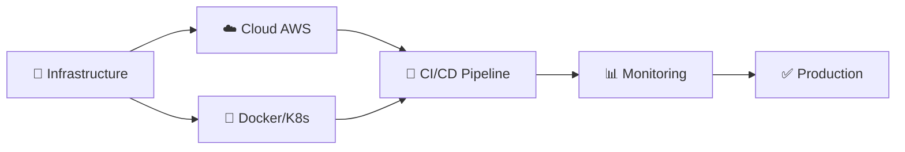

<div align="center">

<!-- Animated Header -->


</div>

<div align="center">
  
[](https://git.io/typing-svg)

</div>

---

<div align="center">

### 🎯 Aperçu Rapide

```ascii
╔══════════════════════════════════════════════════════════════════╗
║  👨‍💻 DevOps Engineer  | 🎓 Ingénieur en Informatique             ║
║  🌍 Tunis, Tunisie   | 📧 mejri.achref.working@gmail.com        ║
║  🔗 LinkedIn: achref-mejri-8a9253179                            ║
╚══════════════════════════════════════════════════════════════════╝
```

</div>

---

## 🌟 À Propos de Moi


```yaml
name: Achref Mejri
role: Ingénieur DevOps & Développeur Full-Stack
location: Tunis, Tunisie
email: achref.mejri.gl@gmail.com
education: 
  - degree: "Ingénieur en Informatique"
    specialization: "Génie Logiciel & Systèmes d'Information"
    institution: "Esprit Ecole Supérieure Privée d'Ingénierie et de Technologie"
    year: "2020 - 2025"

passion: 
  - DevOps & Cloud Architecture
  - Automatisation & CI/CD
  - Solutions Innovantes
  - Développement Full-Stack
  
philosophy: |
  "Le code est de la poésie,
   DevOps est l'orchestre qui la fait vivre"
```

<br clear="both"/>

---

## 🔥 Compétences & Expertise

<div align="center">

### 💻 Langages de Programmation

<table>
<tr>
<td align="center" width="100">

<br>Python
</td>
<td align="center" width="100">

<br>Java
</td>
<td align="center" width="100">

<br>JavaScript
</td>
<td align="center" width="100">

<br>TypeScript
</td>
<td align="center" width="100">

<br>C#
</td>
<td align="center" width="100">

<br>PHP
</td>
</tr>
</table>

### ☁️ DevOps & Cloud

<table>
<tr>
<td align="center" width="100">

<br>Docker
</td>
<td align="center" width="100">

<br>Kubernetes
</td>
<td align="center" width="100">

<br>Jenkins
</td>
<td align="center" width="100">

<br>GitLab CI
</td>
<td align="center" width="100">

<br>Terraform
</td>
<td align="center" width="100">

<br>Ansible
</td>
</tr>
<tr>
<td align="center" width="100">

<br>AWS
</td>
<td align="center" width="100">

<br>Azure
</td>
<td align="center" width="100">

<br>GCP
</td>
<td align="center" width="100">

<br>Prometheus
</td>
<td align="center" width="100">

<br>Grafana
</td>
<td align="center" width="100">

<br>Linux
</td>
</tr>
</table>

### 🎨 Frontend & Backend

<table>
<tr>
<td align="center" width="100">

<br>React
</td>
<td align="center" width="100">

<br>Angular
</td>
<td align="center" width="100">

<br>Vue.js
</td>
<td align="center" width="100">

<br>Node.js
</td>
<td align="center" width="100">

<br>Spring Boot
</td>
<td align="center" width="100">

<br>.NET
</td>
</tr>
</table>

### 🗄️ Bases de Données

<table>
<tr>
<td align="center" width="100">

<br>MySQL
</td>
<td align="center" width="100">

<br>MongoDB
</td>
<td align="center" width="100">

<br>PostgreSQL
</td>
<td align="center" width="100">

<br>Redis
</td>
<td align="center" width="100">

<br>SQLite
</td>
<td align="center" width="100">

<br>Firebase
</td>
</tr>
</table>

</div>

---

## 📊 Statistiques GitHub

<div align="center">
  


</div>

---

## 🏆 Trophées GitHub

<div align="center">
  


</div>

---

## 🎯 Expériences Professionnelles

<div align="left">

### 💼 **Ingénieur DevOps** | Beyatech (Tunisie) - Stage PFE
📅 *Mars 2024 - Septembre 2024*



**Réalisations:**
- ⚡ Conception et déploiement d'une infrastructure cloud scalable sur AWS
- 🔄 Mise en place de pipelines CI/CD avec Jenkins et GitLab CI
- 🐳 Containerisation et orchestration avec Docker et Kubernetes
- 📈 Monitoring et alerting avec Prometheus et Grafana
- 🔐 Sécurisation des déploiements avec AWS IAM et Security Groups

---

### 💼 **Développeur Full-Stack** | Beetsoft (Tunisie) - Stage d'été
📅 *Juillet 2023 - Août 2023*

**Technologies:** Angular · TypeScript · Node.js · MongoDB · Express.js

**Projet:** Développement d'une plateforme web de gestion complète
- 🎨 Interface utilisateur moderne et responsive avec Angular
- 🔧 API RESTful robuste avec Node.js et Express
- 💾 Gestion de base de données avec MongoDB
- 🔐 Authentification et autorisation sécurisées

</div>

---

## 🚀 Projets Remarquables

<div align="center">

<table>
<tr>
<td width="50%">
<h3 align="center">🤖 ChatBot Esprit</h3>
<div align="center">  
<a href="https://github.com/achrefmej/ChatBot_esprit" target="_blank">

</a>
<p><strong>Python · ChatGPT API · NLP</strong></p>
<p align="left">
🔹 Chatbot intelligent pour la lecture de fichiers<br/>
🔹 Intégration de l'API ChatGPT<br/>
🔹 Réponses contextuelles et précises<br/>
🔹 Interface utilisateur intuitive
</p>
</div>
</td>

<td width="50%">
<h3 align="center">📱 Frippy - App Mobile</h3>
<div align="center">
<a href="https://github.com/achrefmej/Frippy" target="_blank">

</a>
<p><strong>Kotlin · Swift · Firebase</strong></p>
<p align="left">
🔹 Application mobile multi-plateforme<br/>
🔹 Version Android (Kotlin)<br/>
🔹 Version iOS (Swift)<br/>
🔹 Backend Firebase en temps réel
</p>
</div>
</td>
</tr>

<tr>
<td width="50%">
<h3 align="center">🗺️ Indoor Navigation</h3>
<div align="center">
<a href="https://github.com/achrefmej/Indoor_Navigation" target="_blank">

</a>
<p><strong>Géolocalisation · Cartographie</strong></p>
<p align="left">
🔹 Système de navigation intérieure<br/>
🔹 Cartographie dynamique<br/>
🔹 Algorithmes de localisation précis<br/>
🔹 Interface interactive
</p>
</div>
</td>

<td width="50%">
<h3 align="center">💼 Portfolio Personnel</h3>
<div align="center">
<a href="https://github.com/achrefmej/Portfolio" target="_blank">

</a>
<p><strong>JavaScript · HTML5 · CSS3</strong></p>
<p align="left">
🔹 Portfolio moderne et responsive<br/>
🔹 Animations et effets interactifs<br/>
🔹 Design épuré et professionnel<br/>
🔹 Optimisé pour tous les appareils
</p>
</div>
</td>
</tr>
</table>

</div>

---

## 📜 Certifications & Formations

<div align="center">

| 🎓 Certification | 🏢 Organisme | 📅 Date |
|:---|:---|:---:|
| ☁️ AWS Certified Solutions Architect | Amazon Web Services | En cours |
| 🐳 Docker & Kubernetes Mastery | Udemy | 2024 |
| 🔄 CI/CD Pipeline Implementation | GitLab | 2024 |
| 📊 Monitoring avec Prometheus & Grafana | Coursera | 2024 |

</div>

---

## 🌐 Langues

<div align="center">

```
�� Arabe       ████████████████████ 100% (Langue maternelle)
�� Français    ████████████████░░░░ 80% (Courant)
�� Anglais     ████████████████░░░░ 80%  (Courant)
```

</div>

---

## 📫 Me Contacter

<div align="center">

[](https://www.linkedin.com/in/achref-mejri-8a9253179)
[](mailto:achref.mejri.gl@gmail.com)
[](https://github.com/achrefmej)
[](https://github.com/achrefmej/Portfolio)

</div>

---

## 🎮 Fun Zone

<div align="center">

### 🐍 Contribution Snake Animation
<picture>
  <source media="(prefers-color-scheme: dark)" srcset="https://raw.githubusercontent.com/achrefmej/achrefmej/output/github-contribution-grid-snake-dark.svg">
  <source media="(prefers-color-scheme: light)" srcset="https://raw.githubusercontent.com/achrefmej/achrefmej/output/github-contribution-grid-snake.svg">
  
</picture>

### 📊 Contribution Graph 3D


### 🎯 Weekly Coding Activity

<!--START_SECTION:waka-->
<!--END_SECTION:waka-->

</div>

---

## 💡 Citation du Moment

<div align="center">


</div>

---

## 📈 Visitor Count

<div align="center">


</div>

---

<div align="center">

### ⭐ N'oubliez pas de laisser une étoile si vous aimez mes projets ! ⭐


**💙 Fait avec passion par Achref Mejri**

</div>
